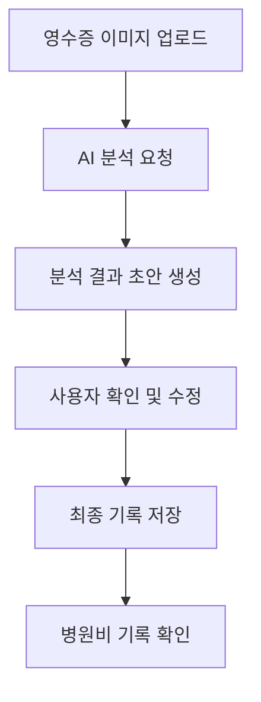

# 🐾 PetLog

> **AI OCR 기반 반려동물 병원비 영수증 분석 및 기록 서비스**
>
> 복잡하고 읽기 어려운 동물병원 영수증을 AI로 간편하게 파싱하고, 보호자가 직접 확인·기록하는 스마트 지출 관리 시스템입니다.

<div align="center">
  
  [](https://react.dev/)
  [](https://www.typescriptlang.org/)
  [](https://vite.dev/)
  [](https://tailwindcss.com/)
  [](https://firebase.google.com/)
  [](https://deepmind.google/technologies/gemini/)

</div>

---

## 📌 1. 프로젝트 개요

동물병원 영수증은 진료 과목이 복잡하고 항목명이 병원마다 상이하여, 보호자가 지출 내역을 직관적으로 이해하고 기록하기 어렵습니다. 

**PetLog**는 영수증 이미지를 업로드하면 AI가 상호명, 날짜, 결제 금액뿐만 아니라 복잡한 병원비 세부 항목까지 파싱하여 기록 초안을 작성해 주는 웹 서비스입니다. AI의 분석 결과는 최종 데이터로 바로 저장되지 않으며, 보호자가 화면에서 직접 검토하고 수정하여 최종 확정하는 **안전하고 신뢰할 수 있는 사용자 검증 흐름**을 제공합니다.

---

## 🔍 2. 제작 배경

동물병원 진료 후 보호자에게 남는 정보는 종이 영수증 한 장인 경우가 대부분입니다. 하지만 병원마다 항목의 명칭과 포맷이 다르고 진료비, 검사비, 처치비, 할인, 세금 등이 복잡하게 섞여 있어 나중에 다시 확인하기 어렵습니다. 

PetLog는 보호자가 이러한 복잡한 병원비 명세서를 단순히 사진으로만 보관하는 것을 넘어, **한눈에 파악하고 지속적으로 기록·관리할 수 있는 정제된 데이터로 변환**하고자 하는 니즈에서 출발하여 제작되었습니다.

---

## ✨ 3. 핵심 기능

### 📸 영수증 이미지 최적화 및 업로드
* **클라이언트 이미지 압축**: Canvas API를 활용하여 클라이언트단에서 이미지를 리사이징 및 압축함으로써, OCR 판독 성능을 보장하면서 서버 전송 리소스를 최소화합니다.
* **보관 신뢰성**: 영수증 원본은 Firebase Storage에 안전하게 업로드되어 데이터의 영속성을 보장합니다.

### 🤖 AI OCR 기반 영수증 분석
* **서버리스 AI 분석**: Vercel Serverless Function 내부에서 Google Gemini 2.5 Flash API를 호출하여 영수증 이미지를 정밀 분석합니다.
* **구조화 데이터 파싱**: 영수증에서 상호명, 날짜, 금액, 할인, 부가세, 세부 처치 항목을 자동으로 추출합니다.
* **오류 복구 구조**: JSON 파싱 예외가 발생할 경우에 대비하여 안전한 기본 데이터 객체로 수렴하게 만드는 Fallback 처리가 적용되어 있습니다.

### 🩺 의료비 세부 항목 분류 (Medical Engine)
* **하이브리드 매칭**: 영수증에서 추출된 세부 처치 내역들을 Whitelist 및 정규식 패턴 기반의 자체 룰 엔진과 결합하여 분류합니다.
* **6대 분류 체계**: 진찰, 검사, 처치, 입원, 수술, 약제 등 6대 의료 카테고리로 자동 매칭 및 분류 작업을 거칩니다.
* **가중치 보정**: 분류 가중치(Keyword, Context, Sequence)를 적용하여 전후 처치 흐름에 따라 분류 신뢰도를 보정합니다.

### ✍️ 사용자 검토 및 데이터 저장
* **검증 기반 UX**: AI가 추출하고 분류한 초안 데이터를 바탕으로 사용자가 수정을 가할 수 있는 Form 인터페이스를 제공합니다.
* **최종 확정 프로세스**: 오분류되거나 숫자가 다르게 읽힌 부분을 사용자가 직접 편집하여 최종 확정(Confirm)한 후에야 Firebase Firestore에 최종 기록이 저장됩니다.

### 🐾 반려동물별 지출 관리
* **멀티 프로필 지원**: 다중 반려동물 프로필 등록을 지원하며, 개별 반려동물의 생일, 품종, 몸무게 등을 개별 관리합니다.
* **기록 매칭**: 영수증의 지출 내역을 각 반려동물 프로필에 매칭하여 반려동물별 개별 지출 및 건강 관리 데이터로 누적합니다.

### 📊 월간 통계 및 데이터 시각화
* **시각 차트**: Recharts 라이브러리를 활용하여 월별 총 지출 트렌드, 카테고리별 지출 비율, 지난달 대비 지출 증감을 제공합니다.
* **모션 가속**: 직관적인 차트 애니메이션(Framer Motion)을 적용해 지출 현황 변화를 시각적으로 이해하기 쉽게 표현했습니다.

---

## 🔄 4. 사용자 흐름



---

## 🛠️ 5. Technical Stack

| 영역 | 기술 스택 |
| --- | --- |
| **Frontend** | React 19, TypeScript, Vite 6 |
| **Styling** | Tailwind CSS v4, Motion (Framer Motion) |
| **State / Routing** | React Router v7, Context API |
| **Backend / DB** | Firebase Auth, Firestore, Storage |
| **AI / API** | Gemini 2.5 Flash (Vercel Serverless Function Proxy) |
| **Deploy** | Vercel |

---

## 💡 6. 주요 구현 포인트

### 🤝 사용자 확인 기반 데이터 저장 (Human-in-the-loop)
AI의 데이터 추출 오류(할인액 누락, 오분류 등)로 인해 부정확한 지출 정보가 그대로 기록되는 것을 예방하기 위해, AI 분석 데이터를 사용자 검토용 Form 필드에 바인딩하여 2차 수정을 거친 후 저장되는 구조를 설계 및 구현했습니다.

### 🛡️ API 상태 처리 및 Fallback UI
네트워크 지연이나 AI 분석 에러 발생 시 앱이 완전히 멈추거나 깨지지 않도록, API 상태별(로딩, 에러, 빈 값) Fallback 컴포넌트를 설계하고 에러 발생 시 수기 입력을 유도하는 대안 플로우를 제공합니다.

### 🔑 보안 중심의 API 호출 설계 (Serverless Function Proxy)
클라이언트 환경변수에 Gemini API Key를 직접 노출하지 않기 위해 Vercel Serverless Function을 프록시로 구성하여 서버 레벨에서 안전하게 API를 호출하도록 설계했습니다. 로컬 개발 환경과 프로덕션 환경의 API 엔드포인트를 자동으로 분기하여 개발 편의성을 높였습니다.

### ⚡ 클라이언트 레벨 이미지 리사이징
고화질의 영수증 사진 업로드 시 발생할 수 있는 네트워크 전송 지연과 비용 문제를 방지하기 위해 HTML5 Canvas를 이용해 원본의 가독성을 잃지 않는 긴 변 2000px 기준, 짧은 변 900px 가독성 보호 리사이징을 클라이언트 단에서 사전에 수행합니다.

### 📱 모바일 환경 최적화 UI/UX
영수증 촬영 및 영수증 확인이 주로 모바일 기기에서 이뤄지는 점을 고려하여 모바일에 최적화된 바텀 시트 구조, 직관적인 폼 입력 인풋, 반응형 레이아웃을 제공합니다.

### 🦺 안전한 AI 결과 표시 (Care Insight)
AI 분석 결과가 진단이나 처방처럼 보이지 않도록 참고용 문구임을 명시하고, 특정 의학적 키워드가 감지되면 사전에 정의한 비의료적 재무 안내 문구(Care Insight Fallback)로 대체하는 가이드레일을 서버 레벨에 구축했습니다.

---

## 📁 7. 폴더 구조

```txt
src/
├─ components/     # 공통 UI 컴포넌트 및 검증 오버레이
├─ contexts/       # Auth, 사용량 제어(Usage), 토스트 등 전역 상태 관리
├─ lib/            # Gemini API, Firebase 인스턴스, 의료비 분류 엔진(medicalEngine.ts)
├─ pages/          # ManualInput(핵심 입력 및 AI 연동), Home, Statistics(통계), Report
├─ types/          # 영수증 데이터 및 반려동물 정보 타입 정의
├─ utils/          # 디버그 헬퍼, 포맷터, 수학 계산 유틸
└─ styles/         # Tailwind CSS v4 기반 디자인 시스템 및 글로벌 스타일
```

---

## 🚀 8. 실행 방법

```bash
# 1. 의존성 패키지 설치
npm install

# 2. 환경 변수 설정
cp .env.example .env
# 생성된 .env 파일에 Firebase 설정 값 및 Gemini API 키(로컬 개발용) 입력

# 3. 개발 서버 실행
npm run dev

# 4. 빌드 및 프로덕션 확인
npm run build
```

### `.env.example` 구성 예시
```env
VITE_FIREBASE_API_KEY=your_firebase_api_key
VITE_FIREBASE_AUTH_DOMAIN=your_firebase_auth_domain
VITE_FIREBASE_PROJECT_ID=your_firebase_project_id
VITE_FIREBASE_STORAGE_BUCKET=your_firebase_storage_bucket
VITE_FIREBASE_MESSAGING_SENDER_ID=your_firebase_messaging_sender_id
VITE_FIREBASE_APP_ID=your_firebase_app_id
VITE_GEMINI_API_KEY=your_gemini_api_key_for_local_dev
VITE_RECAPTCHA_ENTERPRISE_SITE_KEY=your_recaptcha_site_key
VITE_ENABLE_APPCHECK_DEBUG=false
```

---

## 🛠️ 9. 트러블슈팅 / 개선 경험

### 🧩 AI JSON 파싱 에러 방어 및 Fallback UI 적용
* **문제**: AI 모델이 이따금 반환하는 마크다운 코드 블록(```json)이나 쉼표 누락 등의 불완전한 JSON 형식으로 인해 클라이언트에서 `JSON.parse` 에러가 발생하는 현상을 겪었습니다.
* **해결**: 정규식을 이용해 텍스트 내부의 불필요한 마크다운 백틱 문자를 제거하는 Sanitizing 로직을 구현했으며, 최종 파싱 에러 발생 시 기본 데이터를 채워주는 Fail-Safe 구조를 탑재해 앱 크래시를 방지했습니다.

### 🏥 의료법 및 의학적 처방 오인 위험 방지 (Care Insight 가이드라인)
* **문제**: AI 지출 분석 브리핑 기능에서 AI가 임의로 특정 질병을 명시하며 "치료가 시급합니다"와 같은 진단을 내려 의료법 위반 및 오인 리스크가 존재했습니다.
* **해결**: Gemini Prompt에 강력한 금지어 규칙을 명시하고, 서버리스 백엔드 레벨에서 금지 키워드 필터링 시스템을 구축하여 우려가 있는 표현을 일반 건강 관리/재무 기록 권장 메세지로 강제 대체했습니다.

### 📉 고용량 이미지 업로드 병목 해결을 위한 압축 파이프라인 구축
* **문제**: 사용자가 모바일로 촬영한 고화질 영수증 이미지(5MB 이상)를 그대로 서버에 전송해 분석 속도가 지연되거나 API 타임아웃이 발생하는 병목이 발생했습니다.
* **해결**: HTML5 Canvas API를 이용하여 긴 변을 최대 2000px로 축소하면서 퀄리티 0.85 수준의 JPEG로 클라이언트 사이드에서 선제 리사이징을 수행하는 로직을 구축했습니다. 이를 통해 분석 성능에 필요한 텍스트의 가독성을 유지하면서 파일 용량을 평균 80% 이상 절감했습니다.

---

## 📖 10. 배운 점

* **데이터 흐름의 안전성 설계**: AI 분석이나 외부 API는 언제든 부정확한 결과를 반환할 수 있다는 전제 아래, 데이터 저장의 최종 결정권을 사용자에게 부여하고 Form 바인딩을 통해 수정을 거치도록 설계하는 것이 프로덕션 앱에 필수적임을 깨달았습니다.
* **예외 상황과 방어적 프로그래밍**: 네트워크 장애나 OCR 판독 실패와 같은 다양한 예외적 시나리오를 고려한 Fallback UI와 수기 입력 흐름이 갖춰져야 실사용 가능한 완성도 높은 서비스가 됨을 배웠습니다.
* **보안 중심의 프론트엔드 설계**: 브라우저 콘솔 및 네트워크 탭을 통한 API Key 유출 위험성을 방지하고자 서버리스 프록시 환경(Vercel Function)을 설계 및 적용하여, 실무적인 웹 애플리케이션 보안 설계 능력을 기를 수 있었습니다.

---

## 📈 11. 향후 개선 방향

* **영수증 항목 파싱 성능 테스트 자동화**: 다양한 포맷의 테스트 영수증 데이터를 구축하고 OCR 및 항목 분류의 정확도를 주기적으로 측정하는 테스트 스위트 마련
* **모바일 화면 내 세부 항목 일괄 수정 UX 개선**: 폼 입력 필드를 모바일 크기에 맞춰 최적화하고 여러 영수증 행(Row)을 쉽고 빠르게 일괄 변경할 수 있는 UI 컴포넌트 고도화
* **지출 추이 분석 모델 고도화**: 단순 월간 통계를 넘어, 반려동물의 나이와 품종별 평균 지출 트렌드 통계 지표 정보 시각화 확장
* **API 실패 및 타임아웃 시 자동 재시도(Retry) UX 도입**: 일시적인 통신 실패 시 재업로드 필요 없이 부드러운 안내와 함께 백그라운드에서 재시도를 수행하는 안정적인 상태 관리 구축
