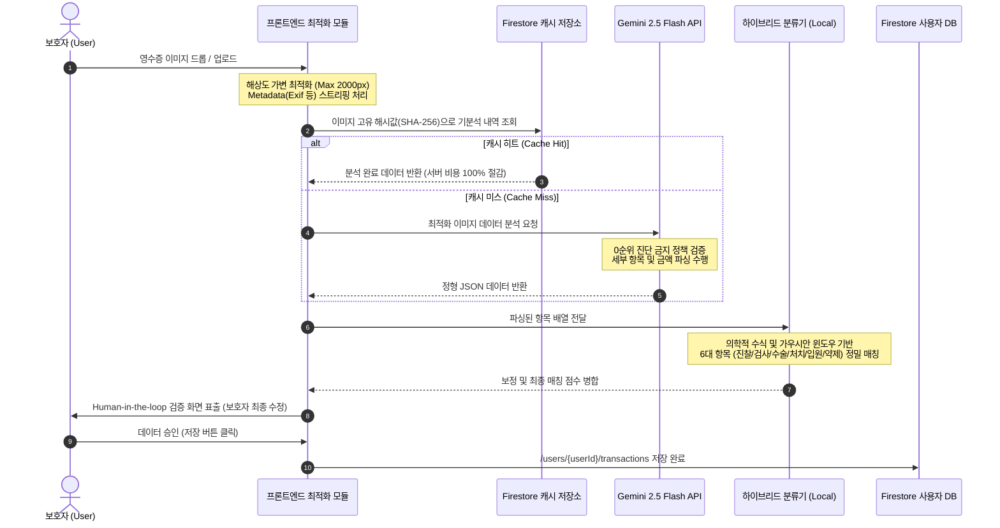
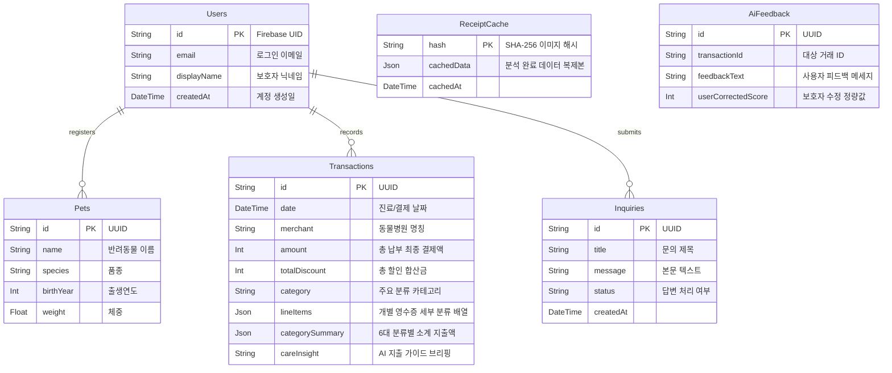

# 🐾 PetLog (펫로그) v3.1.0 RC
### **AI 기반 반려동물 의료비 데이터 분석 및 관리 플랫폼 (Beta Release Candidate)**

<div align="center">
  
  <br/>
  
  [](https://react.dev/)
  [](https://vitejs.dev/)
  [](https://tailwindcss.com/)
  [](https://firebase.google.com/)
  [](https://deepmind.google/technologies/gemini/)
  [](#)
</div>

---

> **비전 (Vision):**  
> 동물병원 영수증은 항목명이 생소하고 계산 내역이 복잡하여 보호자가 직관적으로 파악하기 어렵습니다.  
> **PetLog**는 단순한 텍스트 추출(OCR)을 넘어, 하이브리드 규칙 기반 분류기와 AI 연산, 그리고 사용자 피드백 루프를 결합한 **Human-in-the-loop 엔진**을 통해 보호자가 사랑하는 반려동물의 의료비 데이터를 투명하게 파악하고 예산을 관리할 수 있도록 돕는 프리미엄 웰니스 케어 서비스입니다.

> [!WARNING]  
> **공식 법적 고지:**  
> PetLog 서비스에서 제공되는 PDF 리포트와 AI 케어 브리핑은 오직 보호자의 정보 관리 편의를 위한 참고 자료입니다. 본 서비스는 수의학적 진단/치료/처방 행위를 대행하지 않으며, 세무 증빙 및 펫보험 청구와 같은 공식 금융 증빙 서류를 대체할 수 없습니다.

---

## 🗺️ 목차
1. [🏗️ 기술 아키텍처 & 데이터 파이프라인 (Technical Architecture)](#1-기술-아키텍처--데이터-파이프라인-technical-architecture)
2. [💾 데이터베이스 모델 및 보안 정책 (Database Schema)](#2-데이터베이스-모델-및-보안-정책-database-schema)
3. [🛡️ AI 세이프티 가드레일 & 보안 설계 (Security Hardening)](#3-ai-세이프티-가드레일--보안-설계-security-hardening)
4. [✨ 핵심 분석 엔진 파이프라인 (Core Analysis Pipeline)](#4-핵심-분석-엔진-파이프라인-core-analysis-pipeline)
5. [🎨 UI/UX 디자인 시스템 및 모바일 웹쉘 (Design System)](#5-uiux-디자인-시스템-및-모바일-웹쉘-design-system)
6. [⚙️ 로컬 개발 환경 셋업 & 디버깅 (Setup & Debug)](#6-로컬-개발-환경-셋업--디버깅-setup--debug)
7. [🗂️ 프로젝트 디렉토리 구조](#7-프로젝트-디렉토리-구조)
8. [📈 릴리즈 이력 & 안정화 내역 (Changelog)](#8-릴리즈-이력--안정화-내역-changelog)

---

## 1. 🏗️ 기술 아키텍처 & 데이터 파이프라인 (Technical Architecture)

PetLog는 안정적인 모바일 우선 브라우저 PWA 환경에서 실시간 AI 연산 처리와 강력한 데이터 무결성을 보장하기 위해 분산형 하이브리드 클라우드 아키텍처를 도입했습니다.

### 🖥️ 시스템 구성 요소 다이어그램 (System Diagram)

```mermaid
graph TD
    subgraph Client [Frontend PWA Client (Vercel)]
        App[React 19 & TypeScript App]
        Contexts[Context State Provider]
        ImageEngine[Client-side Image Optimizer]
        HybridClassifier[Medical Analysis Engine]
        App --> Contexts
        App --> ImageEngine
        App --> HybridClassifier
    end

    subgraph Firebase [Backend Cloud Services]
        FAuth[Firebase Authentication]
        Firestore[(Firestore NoSQL Database)]
        Storage[(Firebase Secure Storage)]
    end

    subgraph External [AI & Processing Integration]
        GeminiProxy[Google Gemini 2.5 Flash Proxy]
        NaverOCR[Naver Clova OCR API]
    end

    App -- Web SDK Secure Auth --> FAuth
    App -- Rules-Checked Queries --> Firestore
    ImageEngine -- Base64 String --> GeminiProxy
    ImageEngine -- Optimized File Upload --> Storage
    HybridClassifier -- Local Parsing Fallbacks --> App
    GeminiProxy -- JSON Structure Response --> App
```

---

### 📝 실시간 영수증 OCR 및 AI 분석 데이터 흐름 (Data Pipeline)

사용자가 동물병원 영수증 이미지를 업로드할 때 시작되는 6단계 처리 파이프라인입니다.



---

### 🧰 기술 스택 상세 (Technology Stack)

| 레이어 | 적용 기술 | 도입 근거 및 핵심 역할 |
| :--- | :--- | :--- |
| **Frontend** | `React 19`<br>`TypeScript`<br>`Vite 6`<br>`React Router v7` | • React 19의 컴포넌트 라이프사이클을 사용한 고해상도 렌더링 최적화<br>• Vite 6를 통한 0.1초 미만의 고속 HMR 개발 환경 구축<br>• TypeScript 기반 컴파일 단계 타입 바인딩으로 정밀 쿼리 가독성 확보 |
| **Styling** | `Tailwind CSS v4`<br>`Motion/React` | • 최신 Tailwind v4 CSS 엔진을 활용해 프레임리스 테마 및 모바일 스페이싱 제어<br>• Motion/React (Framer Motion v12)로 터치 가로 스와이프 피드백 등 고성능 하드웨어 가속 애니메이션 탑재 |
| **Database** | `Firebase Firestore`<br>`Firebase Storage` | • NoSQL 구조의 오프라인 데이터 지속성 오버레이 및 오프라인 복구 정책 지원<br>• Firebase Storage 내 비공개 버킷 격리 설정으로 개인의 영수증 무결성 유지 |
| **AI & Engine** | `Google Gemini 2.5 Flash`<br>`Naver Clova OCR` | • Gemini 2.5 Flash를 활용한 한국어 영수증 항목의 고밀도 금융 수치 파싱<br>• 자체 개발 수식 필터와 AI 분석 모델을 결합한 하이브리드 지출 정밀 매칭 |

---

## 2. 💾 데이터베이스 모델 및 보안 정책 (Database Schema)

PetLog는 데이터 유출 방지와 완벽한 멀티테넌시(Multi-tenancy) 구조를 구현하기 위해 Firestore Security Rules 기반의 **완벽 분리 격리 정책**을 전역에 강제했습니다.

### 🔒 테넌트 격리형 Firestore 보안 규칙 (Default Deny Pattern)
*   **루트 격리**: 모든 유저 개인 정보 및 반려동물 프로필, 결제 지출 정보는 `/users/{userId}` 하위 서브 콜렉션 트리로 일괄 배치됩니다.
*   **인가 규칙**: `request.auth.uid == userId`를 충족하는 로그인 세션 소유주 본인만 데이터를 CRUD할 수 있으며, 타인의 어떠한 정보 검색 시도도 DB 엔진 단에서 강제 드롭(Block)됩니다.
*   **기밀 캐싱**: `/receipt_cache/{hash}`와 `/ai_feedback/{id}` 모델을 분산하여 중복 LLM API 호출 요금을 절감하되 조회 권한을 제한했습니다.



---

## 3. 🛡️ AI 세이프티 가드레일 & 보안 설계 (Security Hardening)

의료 분석 가이드는 생명에 직관되며 매우 민감하므로, 비즈니스 신뢰도를 확보하고 위험을 통제하기 위한 안전 가드레일을 적용했습니다.

### 🩺 1. Care Insight 의료 진단 및 처방 방지 가드레일
*   **원천 단어 교체 필터 (Zero-Medical Diagnosis)**:
    - AI 모델이 불확실한 의료 진단(예: "파보 장염 의심", "슬개골 탈구 치료 요망" 등)을 임의로 수행하는 것을 엄격히 금지합니다.
    - AI가 응답 시 다음 단어군을 출력할 시 백엔드 및 클라이언트 가드레일 필터가 이를 즉각 감지하여 Fallback 텍스트로 강제 변환합니다.
    > **차단 키워드 목록:** `파보`, `질병 가능성`, `질환 가능성`, `집중 치료`, `정밀 검사`, `치료가 진행`, `상태를 면밀히`, `회복 상태 관찰`, `회복을 관찰`, `복용시켜`, `내원 일정을 꼭`, `슬개골`, `심장 질환` 등
*   **기록/재무 가이드 지향**:
    - 모든 AI 요약 및 제안 피드는 반려동물의 건강이 아닌 **지출 통계 및 병원에서 제공받은 공식 약제/진료 기록을 관리 도구에 등록하도록 가이드**하는 역할로 제한됩니다.

### 🖼️ 2. 개인 정보 및 이미지 정보의 생명주기 관리
*   **휘발성 메모리 분석 파기**: 이미지 전송 전, 클라이언트 단계에서 EXIF 위도/경도 메타데이터를 일체 파기하고 이미지를 가변 리사이징하여 속도 향상 및 개인정보 침해 가능성을 사전에 방어합니다.
*   **최소 권한 전송**: 데이터 분석용 가변 리사이징 이미지는 분석 엔진 메모리 상에서 처리 완료 후 즉시 파기되며, 영구 보존용 원본은 Firebase Storage 암호화 구간에 전송되어 저장됩니다.

### 🔑 3. 중요 처리 재인증 절차 (Re-authentication)
*   사용자 비밀번호 수정, 연동 이메일 교체, 그리고 서비스 영구 회원 탈퇴(`/withdrawal`)와 같은 보안 리스크가 큰 기능을 실행하기 직전에는 **구글 또는 자체 이메일 재인증 프로세스**를 의무적으로 완료해야 잠금이 해제되도록 설계되었습니다.

---

## 4. 핵심 분석 엔진 파이프라인 (Core Analysis Pipeline)

PetLog는 AI 결과의 구조적 오차와 오분류를 바로잡기 위해 **확률적 하이브리드 분류 엔진 (MedicalAnalysisEngine)**을 프론트엔드 단에 상주시켜 구동합니다.

```
                  ┌─────────────────────────────────────┐
                  │      Hospital Receipt Line Items    │
                  └──────────────────┬──────────────────┘
                                     │
                    [0a. Regular Expression Matcher]
                                     ├───────────────── (Yes) ──► [ MEDICINE / FOOD ]
                                     │ (No)
                     [0b. Force Whitelist Whitelist]
                                     ├───────────────── (Yes) ──► [ Fixed Match ]
                                     │ (No)
                         [1. Keyword Scoring (K)]
                                     │ (Weights mapping)
                     [2. Context Window Analyzer (C)]
                                     │ (Anesthesia / Surgery context sliding window +-3)
                        [3. Sequence State Machine (S)]
                                     │ (Pre-surgery vs Post-surgery state detection)
                                     ▼
                      Normalized Probabilistic Score
                                     │
                             Top 2 Delta Check
                                     ▼
                            [Final Target Match]
```

### 🧠 1. 하이브리드 의료 항목 분류 (Probabilistic Classifier)
*   **규칙 매칭 (Regex & Whitelist)**: 복약 지침(`mg`, `mcg`, `BID`, `TID`, `QD`) 및 사료 브랜드(`Royal Canin` 등)가 감지되면 정규표현식을 통해 최우선으로 `MEDICINE` 또는 `FOOD`로 분류합니다.
*   **컨텍스트 윈도우 감지 (Context Window)**: 특정 라인 주변(이전/이후 각 3개 줄)에 `마취`, `수술`, `Anesthesia` 관련 단어가 있을 경우, 해당 항목이 `수술비`나 `수술용 소모품`에 연계되었을 확률(Context Weight)을 계산하여 가중치를 보정합니다.
*   **순서 상태 머신 (Sequence State)**: 수술 항목이 처음 시작된 지점을 기점으로, 수술 전 검사(Pre-surgery Test) 영역과 수술 후 회복 및 약제 조제(Post-surgery Recovery) 영역의 상태를 식별하여 모호한 검사 항목을 정밀 매칭합니다.

### 💰 2. 금융 세무 데이터 안분 처리 (Financial Allocation Engine)
*   **부가세(VAT) 분리**: 영수증 내 면세 항목과 과세 항목을 식별하여 정확한 부가세 분리 연산을 실시간 수치 검증합니다.
*   **글로벌 할인액 분할 분배 (Global Discount Apportionment)**:
    - 영수증 전체에 총액 할인(쿠폰 적용 등)이 적용되었을 때, 개별 진료 과목별로 실질적인 할인 기여 비율을 가중 안분하여 개 개별 항목의 진짜 순수 결제액(`finalAmount`)을 추론합니다.

---

## 5. UI/UX 디자인 시스템 및 모바일 웹쉘 (Design System)

PetLog는 모바일 접근성이 극대화된 모바일 전용 뷰포트 가로폭 테마를 유지하면서도 데스크톱 및 패드 브라우저 화면에서 어색함이 없도록 고안된 모바일 웹쉘(Mobile Web Shell) 위에 얹혀 구동됩니다.

*   **Tailwind CSS v4 가변 그리드 테마**: 모던 다크모드 대응을 위한 테마 변수 및 `shadow-[0_8px_30px_rgb(0,0,0,0.04)]` 등의 정교한 카드 보더를 일체화했습니다.
*   **터치 중심 슬라이드 바**: 신청 기록 상태 관리 시 양옆 스와이프를 지원하는 탭 구조를 통해 엄지손가락 범위 안에서 모든 컨트롤이 처리됩니다.
*   **동적 UI 스켈레톤 & Fallback**: API 지연 구간 동안 화면이 빈 채로 방치되는 사용자 이탈을 막기 위해 시각적인 애니메이션 스켈레톤 컴포넌트를 필수 바인딩하였습니다.

---

## 6. 로컬 개발 환경 셋업 & 디버깅 (Setup & Debug)

### 📋 1. 로컬 개발 서버 구동 방법
```bash
# 1. 의존성 모듈 설치
npm install

# 2. 로컬 실행 환경 변수 셋업
cp .env.example .env
```

`.env` 파일에 아래 필수 정보들을 기입합니다:
```env
# AI API Key (로컬 테스트 및 브랜치 단독 테스트용)
VITE_GEMINI_API_KEY="AIzaSyYourGeminiApiKeyHere"

# Firebase App SDK 연동 정보
VITE_FIREBASE_API_KEY="AIzaSy..."
VITE_FIREBASE_AUTH_DOMAIN="petlog-app.firebaseapp.com"
VITE_FIREBASE_PROJECT_ID="petlog-app"
VITE_FIREBASE_STORAGE_BUCKET="petlog-app.appspot.com"
VITE_FIREBASE_MESSAGING_SENDER_ID="12345678"
VITE_FIREBASE_APP_ID="1:123456:web:abcd"
```

```bash
# 3. 로컬 Vite 개발 서버 구동 (포트: 3000로 가동됨)
npm run dev
```

---

### 🛠️ 2. 전역 디버그 모드 (PETLOG_DEBUG)

PetLog는 중요 런타임 오류와 AI 분석 내역의 정확도를 정밀히 추적하고 QA 품질을 검수할 수 있는 중앙집중형 디버그 시스템을 지원합니다.

*   **디버그 모드 활성화 방법**:
    - 브라우저 개발자 도구(F12) 콘솔 탭을 엽니다.
    - 아래 명령어를 입력하고 화면을 새로고침합니다.
    ```javascript
    localStorage.setItem('PETLOG_DEBUG', 'true');
    ```
*   **활성화 시 추가 동작**:
    - 이미지 최적화 성능 계수(가변 리사이징 크기, 무손실 압축율) 실시간 콘솔 출력.
    - Gemini AI 수신 JSON 구조 원본 로깅.
    - 하이브리드 분류 엔진의 6대 진료 항목 카테고리 매칭 신뢰 점수(Confidence Raw Scores) 세부 출력.
    - 세무 영수증 부가세 및 전체 할인금 정산 잔액 오차 세부 로그 표시.

---

## 7. 프로젝트 디렉토리 구조

```text
petlog/
├── public/             # PWA 매니페스트, 오프라인 정적 에셋 파일
├── src/
│   ├── components/     # 글로벌 재사용 원자 UI 및 검증용 모달 레이어
│   │   ├── common/     # Button, Card, Toast, Modal 등 공통 요소
│   │   └── report/     # PDF 출력 양식 및 영수증 매칭 결과 인터렉티브 폼
│   ├── contexts/       # Firebase 로그인 세션 및 전역 토스트 상태 공급 장치
│   ├── lib/            # 외부 API 연동 통합 레이어
│   │   ├── gemini.ts   # Gemini API 중개 및 0순위 가이드라인 검증 로직
│   │   ├── firebase.ts # Firebase SDK 인스턴스 초기화 및 DB 연결
│   │   └── medicalEngine.ts # 하이브리드 의료비 6대 분류 연산 엔진
│   ├── pages/          # 화면 컴포넌트 (ManualInput, Transactions, Home 등)
│   ├── translations/   # 다국어 리소스 관리 모듈
│   ├── styles/         # Tailwind CSS 테마 변수 및 글로벌 CSS 변수
│   ├── types/          # 거래 기록, 동물 모델, AI 출력 타입 규격
│   ├── utils/          # 디버그 로그(`isPetLogDebug()`), 포맷팅 공통 헬퍼
│   ├── App.tsx         # 전역 라우터 분기 및 모바일 쉘 바인딩
│   └── main.tsx        # React 19 가동 루트 진입 스크립트
├── firestore.rules     # Firestore 보안 및 격리 규칙 정의서
├── vercel.json         # Vercel 배포 세팅 및 백엔드 프록시 포트 설정
└── vite.config.ts      # Vite 번들러 및 Tailwind 플러그인 설정 파일
```

---

## 8. 릴리즈 이력 & 안정화 내역 (Changelog)

### 📌 **v3.1.0 RC (Beta Release Candidate)**
*   **Fail-Safe UI 안전성 보강**: 모바일 네트워크 이상 또는 AI 서버 장애로 인한 반환 데이터 손실 시 화면이 빈 공간으로 멈추는 에러를 극복하기 위해, 모든 화면 카드에 에러 바운더리 폴백 디자인을 적용 완료했습니다.
*   **보안 계정 해제 검증 강화**: 회원 탈퇴와 같이 계정 소유권에 큰 충격을 주는 액션 요청에 대해 **Google / 이메일 재인증 프롬프트**를 통과하도록 강제 설계하여 명의 도용 위험을 최소화했습니다.
*   **오류 방어용 디버그 유틸리티 도입**: 콘솔 레벨에서 디버깅 명령 시 빈값 참조 에러(`ReferenceError`)를 차단하는 `isPetLogDebug()` 라이브러리를 전면 도입하고 보안 로그 저장소를 일원화했습니다.
*   **AI API 데이터 연동 정합성 복구**: 영수증 세부 분류 반환 시 데이터 형식이 불일치하여 발생하던 API `400 Bad Request` 에러의 파라미터 구조를 완벽 보정하고 인터페이스 수정을 마쳤습니다.
*   **Care Insight 의료 가이드 룰셋 고도화**: 특정 수의학적 질병 명칭이 노출되었을 때 진단으로 해석될 위험을 완전히 차단하는 AI 가드레일을 대폭 강화하고 안정적인 참고 자료로서의 성격을 명확히 했습니다.
*   **한국어 사용자 중심 UI 개편**: 베타 서비스 기간 동안 혼란을 주던 미완성 다국어 로직을 제거하고 한국어 유저 타겟의 간결하고 아름다운 UI 디자인으로 통일했습니다.
